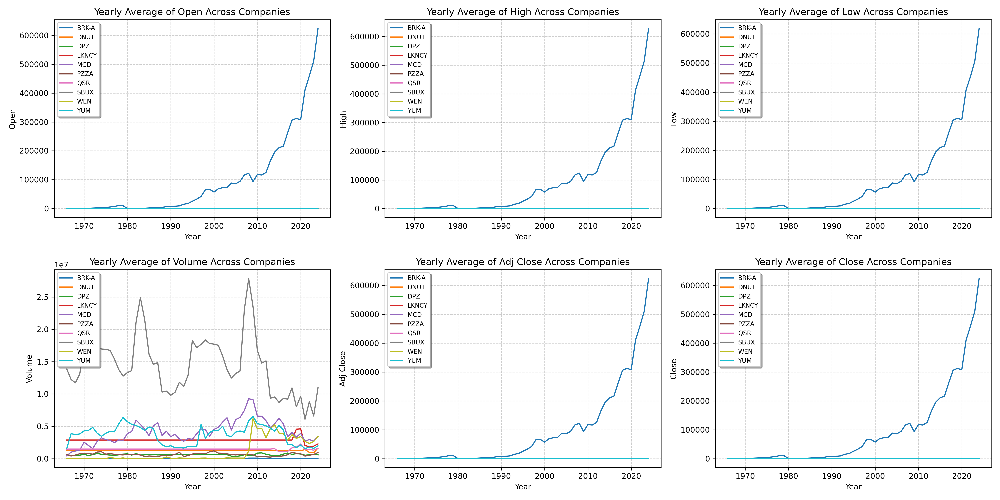
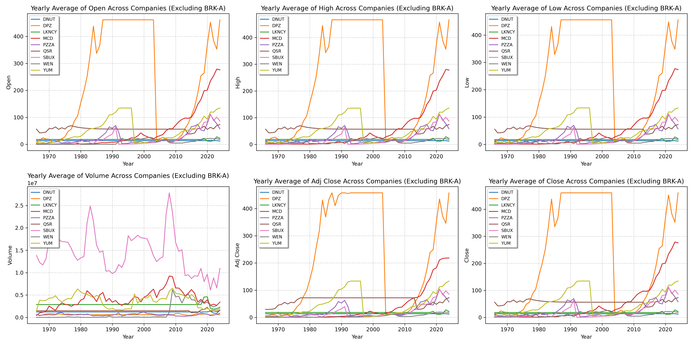

# Python for Data Science - Final Project - ESADE Business School

This repository contains the final project of "Python for Data Science" course completed during our Master's degree in Business Analytics at ESADE Business School.

# **Fast Food Companies: A Deep Performance Analysis** 

## **Project Overview**
This project aims to analyze the performance of 10 major fast food companies in the stock market over the years. To achieve this, historical stock price data from 10 companies was processed and analyzed: Berkshire Hathaway Inc., Krispy Kreme, Domino’s Pizza, Luckin Coffee, McDonald’s, Papa John’s, Restaurant Brands, Starbucks, Wendy’s, and Yum! Brands. The analysis includes data cleaning, visualization creation, and the extraction of insights to assess the market behavior of these companies.

## **Objective**
The main goal of this analysis is to tackle the various exercises designed to study the stock market performance of major fast food companies. Through this team effort, we aim to address each of the proposed objectives, learn how to interpret financial data, and generate meaningful insights into price trends, trade volumes, and other key factors that influence the performance of these companies in the market.

## **Data Preprocessing**
Before beginning the analysis, data preprocessing was performed to ensure that the results were accurate and meaningful:

- **Outlier Removal**: Outliers in the "Close" column were identified and removed using the Interquartile Range (IQR) method.
- **Handling Missing Values**: Missing values were imputed using linear interpolation and forward/backward fill methods to ensure continuity in the dataset.
- **Chronological Sorting**: The data was sorted based on the "Date" column to facilitate time-series analysis.

-----

## **Analysis and Exercises**

Below is a detailed breakdown of the exercises, the methods applied, and the insights obtained throughout the analysis.

### **Exercise 1: Dataset Overview**

The first exercise focused on analyzing the structure of the provided datasets to verify their consistency. For this purpose, each file was loaded and evaluated to obtain the number of rows and columns, as well as the column names and their respective data types.

**Key Results**:
- All datasets have a consistent structure with 7 main columns:
  - `Date` (Datetime64)
  - `Open`, `High`, `Low`, `Close`, `Adj Close`, `Volume` (Float64).
- The number of rows varies between companies, reflecting differences in the availability of historical data.

**Summary Table**:

| Dataset  | Rows   | Columns |
|----------|--------|---------|
| BRK-A    | 11,222 | 7       |
| DNUT     | 810    | 7       |
| DPZ      | 5,083  | 7       |
| LKNCY    | 1,345  | 7       |
| MCD      | 14,652 | 7       |
| PZZA     | 7,878  | 7       |
| QSR      | 2,459  | 7       |
| SBUX     | 8,117  | 7       |
| WEN      | 11,187 | 7       |
| YUM      | 6,796  | 7       |

**Insights**:
- The `Close` column will be crucial for the financial analysis, as it represents the final stock price of each session.
- The `Date` column ensures chronological alignment, which is essential for time-series analysis.

-----

### **Exercise 2: Close Price Trends for 2023**

The second exercise involved analyzing the stock price trends for the year 2023. To achieve this, the datasets were filtered to include only rows corresponding to 2023. Then, line plots were generated to visualize the **Close** price trends for all 10 companies during this period.

**Steps Taken**:
- The datasets were filtered to retain only rows from 2023.
- Line plots were created to visualize the **Close** price trends for each company, showing fluctuations over the year.
- Several companies experienced significant dips in March 2023, followed by recoveries later in the year.

**Results & Visualization**:

Below is a combined view of the stock price trends for all companies during 2023:

**Insights**:
- Companies such as **BRK-A** and **DPZ** showed a noticeable dip around March 2023, potentially due to market-wide factors.
- By October 2023, most companies demonstrated recovery trends, reflecting improved conditions.
- Fast food-related stocks, such as **MCD**, displayed greater stability compared to other companies.

-----

### **Exercise 3: Highest Close Prices**

The third exercise focused on identifying the day with the highest **Close** price for each company and recording the corresponding price and date.

**Steps Taken**:
- The highest **Close** price was located for each dataset by iterating through the data and identifying the row with the maximum value.
- Both the highest price and its corresponding date were extracted for each company.

**Results: Summary Table**:

| Dataset  | Highest Close Price | Date       |
|----------|---------------------|------------|
| BRK-A    |      715910.0       | 2024-09-03 |
| DNUT     |        21.0         | 2021-07-01 |
| DPZ      |       564.33        | 2021-12-31 |
| LKNCY    |        50.02        | 2020-01-17 |
| MCD      |       300.53        | 2024-01-19 |
| PZZA     |       140.01        | 2021-11-04 |
| QSR      |        82.75        | 2024-03-13 |
| SBUX     |       126.06        | 2021-07-26 |
| WEN      |        32.0         | 1993-09-13 |
| YUM      |       143.19        | 2024-04-29 |

**Insights**:
- The datasets demonstrate consistency, as all files contain the same 7 columns.
- The **Close** column continues to play a critical role in identifying trends, with notable price peaks for specific companies during distinct periods.
- Dates associated with the highest prices vary, indicating differences in market performance across the companies.

-----

### **Exercise 4: Comparing Monthly Average Close Prices**

The fourth exercise focused on calculating the monthly average **Close** price for each company and comparing the trends for three selected companies. The goal was to group the data by month and visualize the comparisons using a line chart.

**Steps Taken**:
- The data was grouped by month for each company.
- The monthly average **Close** price was calculated across all years.
- A line plot was created to compare the monthly trends for three companies: **SBUX**, **MCD**, and **WEN**.

**Results & Visualization**:

Below is the line chart comparing the monthly average **Close** price trends for the selected companies:

**Insights**:
- **MCD** consistently shows the highest average close price among the selected companies.
- **WEN** displays the lowest average close price across all months.
- Monthly variations are minimal for all companies, indicating relatively stable average prices throughout the year.

-----

### **Exercise 5: Computing and Comparing Yearly Average Close Prices**

The fifth exercise involved calculating the yearly average **Close** price for each company and comparing the trends across all companies. A line plot with a logarithmic y-scale was used to highlight disparities in value and stability between companies.

**Steps Taken**:
- The data was grouped by year for each company.
- The yearly average **Close** price was calculated and stored for all companies.
- A line plot was created using a logarithmic y-scale to better visualize differences between companies with vastly different price ranges.

**Results & Visualization**:

Below is the line chart comparing the yearly average **Close** price trends for all companies:

**Insights**:
- Companies like **BRK-A** demonstrate significantly higher average closing prices and sustained growth, reflecting their dominance and market value.
- Smaller companies like **DNUT** and **WEN** exhibit lower values and more modest growth trends.
- Most companies show upward trends in recent years, reflecting broader market growth or recovery from economic downturns.

-----

### **Exercise 6: Visualizing the Range of Prices for Each Month**

The sixth exercise focused on analyzing the range of **Close** prices for each month across all companies. For this purpose, the minimum and maximum values were calculated for each month, and a filled line plot was created to illustrate the price range.

**Steps Taken**:
- The data was grouped by **Year-Month** for each company.
- The minimum and maximum **Close** prices were computed for each month, and the range was visualized using a filled line plot.
- Two companies, **DNUT** and **WEN**, are highlighted below as examples.

**Results & Visualizations**:

- **Price Range for DNUT**:
  

- **Price Range for WEN**:
  

- **All graphs displayed in one image for easy visualisation**:
  

**Insights**:
- **DNUT** exhibits a relatively consistent price range, with notable spikes in volatility during late 2023 and early 2024. This could be influenced by market adjustments or company-specific factors.
- **WEN** shows significant price range spikes during periods of economic crisis, such as the 2008 financial crisis and the COVID-19 pandemic in 2020. These spikes highlight market reactions to broader global events.

-----

### **Exercise 7: Volume – Close Price Relation**

This exercise aimed to investigate the relationship between trading volume and the closing price. By analyzing correlations across all datasets, we identified the company with the strongest relationship and visualized it using an effective scatter plot representation.

**Steps Taken**

- Calculated the correlation coefficient between trading volume and closing price for each company to determine the strength of their relationship.
- Identified YUM as the company with the highest correlation value (0.39), indicating a moderate association.
- Chose a scatter plot to visualize the relationship for YUM, as it highlights individual data points, clusters, and outliers, offering clarity on how trading activity aligns with price dynamics.

**Correlation Results for All Companies**

| Company    | Correlation |
|------------|-------------|
| BRK-A.csv  | 0.14        |
| DNUT.csv   | 0.15        |
| DPZ.csv    | 0.01        |
| LKNCY.csv  | -0.08       |
| MCD.csv    | 0.02        |
| PZZA.csv   | -0.11       |
| QSR.csv    | 0.02        |
| SBUX.csv   | -0.31       |
| WEN.csv    | -0.08       |
| YUM.csv    | **-0.39**   |

*YUM was selected due to its highest absolute correlation value (-0.39), indicating the strongest relationship between trading volume and closing price.*

**Key Results**:
- YUM showed the highest correlation of **0.39** between trading volume and closing price.
- The scatter plot highlighted clustering at lower trading volumes, with occasional spikes corresponding to a wide range of closing prices.

**Results & Visualization**:

Below is the scatter plot representing the relationship between trading volume and closing price for YUM:

**Insights**:
The correlation of 0.39 between trading volume and closing price for YUM suggests a moderate relationship. While not strong, it indicates that periods of high trading activity may be linked to significant price movements. The scatter plot reveals that most trading volumes cluster at lower levels, with occasional spikes. These spikes are associated with a wide range of closing prices, hinting at extraordinary market events driving both volume and price simultaneously. 

Historical context suggests that events like **YUM China’s spin-off (2016)** or market disruptions such as the **COVID-19 pandemic (2020)** may have contributed to these trading anomalies. Understanding this pattern helps detect shifts in investor behavior during high-volume periods.

-----

### **Exercise 8: Volume – Top Volume Month**

This exercise aimed to identify the month with the highest total trading volume for each company. By grouping data by Year-Month, the total trading volume was calculated, and the peak month for each company was identified. A summary table and related insights were generated to analyze the results.

**Steps Taken**:
- Grouped the trading volume data by **Year-Month** for each company.
- Calculated the **total trading volume** for each month.
- Identified the **month with the highest total volume** for each company.
- Compiled the results into a summary table for analysis and visualization.

**Results: Summary Table**:

| Company | Month          | Total Volume   |
|---------|----------------|----------------|
| BRK-A   | February 2010  | 10,232,800     |
| DNUT    | July 2021      | 90,072,000     |
| DPZ     | May 2012       | 32,425,600     |
| LKNCY   | June 2020      | 1,315,835,800  |
| MCD     | October 2006   | 419,618,400    |
| PZZA    | December 1999  | 130,818,800    |
| QSR     | March 2020     | 110,310,400    |
| SBUX    | July 1999      | 1,210,239,200  |
| WEN     | June 2009      | 282,283,400    |
| YUM     | October 2015   | 218,777,316    |

**Insights**:
1. The highest trading volume (1.3 billion) occurred during Luckin Coffee’s accounting fraud scandal and the post-pandemic recovery in China, driving significant market activity.
2. Trading spikes align with major crises, like the **financial crisis (2009)** for WEN and **COVID-19 (2020)** for QSR, highlighting the macroeconomic impacts on trading behavior.
3. Milestones such as Starbucks’ global expansion (1999) and YUM’s spinoff announcement (2015) drove high trading activity, reflecting investor focus during pivotal moments.
4. Trading volume spiked during Y2K market activity, reflecting heightened investor positioning amid millennium-driven volatility.

These results emphasize how company-specific events and broader economic trends influence trading activity, offering valuable context for analyzing market behavior during high-volume periods.

-----

### **Exercise 9: Yearly Aggregated Combined Dataset with No Missing Values**

This exercise aimed to create a unified dataset by merging yearly averages of stock-related metrics for all companies. 

The dataset was aligned on the `Year` column, with missing values imputed using the ARIMA (Auto-Regressive Integrated Moving Average) model. The results were analyzed through visualizations to observe trends across key metrics such as Open, High, Low, Close, Volume, and Adjusted Close.

**Steps Taken**:
1. Grouped each company’s data by year and calculated yearly averages for stock-related metrics.
2. Merged the yearly data from all companies using an outer join on the `Year` column.
3. Imputed missing values using ARIMA with enhanced backcasting techniques:
   - Automated parameter selection (`auto_arima`) to minimize manual adjustments.
   - Non-negative predictions for missing values.
   - Applied smoothing mechanisms to handle sudden jumps in the imputed data.
4. Visualized yearly trends for each metric to identify patterns across companies.

**Reasons for Using ARIMA**:
- Captures temporal dependencies for realistic backcasting in time-series data.
- Removes seasonality to focus on underlying trends.

**Additional Adjustments**:
- Ensured a non-negative floor for predictions to maintain data validity.
- Applied a smoothing mechanism to mitigate issues from sparse or volatile data.

**Results & Visualizations**:

- **Yearly Trends (Including BRK-A)**:
  Displays the dominance of BRK-A across all metrics (Open, High, Low, Close, Volume, Adjusted Close) due to its significantly higher values.

  

- **Yearly Trends (Excluding BRK-A)**:
  Excludes BRK-A to avoid distortion caused by its extremely high values, enabling clearer comparisons and insights for smaller companies.

  

**Insights**:
- BRK-A consistently shows higher values across all metrics, emphasizing its dominance in the market.
- Smaller companies like SBUX and MCD display steady growth, reflecting strong investor confidence over time.
- Companies like DNUT and WEN reveal more volatility, indicating reactions to specific market events.
- Volume trends highlight activity surges in years like 2020, influenced by global economic factors such as the pandemic.
- ARIMA effectively imputed missing values, preserving trends and ensuring data consistency, though limitations in handling highly volatile data were noted.

-----

### **Exercise 10: Daily Spread Analysis for Each Company**

This exercise focused on calculating and analyzing the daily spread (difference between the High and Low prices) for each company, visualizing the results across all companies, and interpreting patterns based on average spreads.

**Steps Taken**

1. **Daily Spread Calculation**:
   - A new column `Spread` was created for each company's dataset to compute the daily spread as the difference between `High` and `Low` prices.
   - A validation check was implemented to ensure that `High` > `Low`. If not, the spread was set to `0`.

2. **Data Visualization**:
   - Plotted individual line graphs for all companies showing the daily spread over time. This provides a detailed view of price fluctuations across their respective trading periods.

3. **Average Spread Computation**:
   - The mean spread was calculated for each company to compare their average price volatility.
   - A bar chart was plotted using a logarithmic scale to accommodate the large range in values, especially due to the high values of BRK-A.

4. **Key Interpretation**:
   - Insights into the spread patterns for the top companies with the highest spreads were derived, focusing on market behavior and stock price characteristics.

**Results and Visualizations**

**Figure 1: Daily Spread Across All Companies**
Below is a visualization of daily spreads for all companies over their trading periods. Each graph highlights the general volatility and trends in daily spreads specific to each company.

#### **Figure 2: Log-Scaled Average Spread**
This bar chart presents the average spread for each company on a logarithmic scale, making it easier to compare companies with vastly different spread magnitudes.

**Insights**

- **BRK-A** exhibits an extraordinarily high average spread, attributable to its significantly high stock price. Minor percentage changes in its price lead to substantial absolute differences between daily highs and lows.
- **DPZ** (Domino's Pizza) shows the second-highest average spread due to its growth-oriented volatility, reflecting investor expectations of rapid revenue growth.
- Companies like **DNUT**, **QSR**, and **WEN** have smaller spreads, attributed to their relatively lower stock prices and stable trading patterns, resulting in nominal daily price fluctuations.
- The use of a logarithmic scale effectively highlights the differences in average spread magnitudes across companies while normalizing BRK-A's influence.

These results underline how company-specific factors such as stock price, growth potential, and investor behavior influence daily price spreads. The findings provide a deeper understanding of market volatility for individual stocks. 

-----

### **Required Libraries**

1. **Pandas**: For data manipulation and analysis.
   
bash
   pip install pandas

2. **NumPy**: For mathematical operations and handling multidimensional arrays.

bash
  pip install numpy

3. **Matplotlib**: For creating visualizations and plots.

bash
  pip install matplotlib

4. **Seaborn**: For advanced statistical plots and style customization (optional).

bash
  pip install seaborn

5. **pmdarima**: For automated ARIMA modeling and backcasting.

bash
  pip install statsmodels

6. **pip install pmdarima**: For automated ARIMA modeling and backcasting.

bash 
  pip install pmdarima
  

  **7. Datetime**: For handling date and time data (no installation required, part of Python's standard library).

  **8. Math**: For mathematical calculations like logarithms (no installation required, part of Python's standard library).

  **9. Warnings**: For managing warnings during script execution (no installation required, part of Python's standard library).

  **10. OS**: For handling file paths and system-level 
